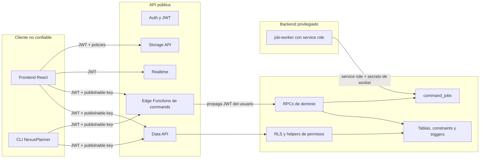

# NexusPlanner Backend Architecture

Última revisión: 2026-09-26

## 1. Propósito

Este repositorio empaqueta el backend reproducible de NexusPlanner sobre Supabase. Su responsabilidad es conservar, validar y exponer el modelo multi-organización del producto sin incluir información personal de ninguna instalación.

La unidad de despliegue local es el stack administrado por Supabase CLI. El repositorio no incluye todavía un `docker-compose.yml` de producción. En desarrollo, la CLI levanta Postgres, Auth, PostgREST/Data API, Realtime, Storage, Studio, Mailpit y Edge Runtime.

## 2. Capacidades, No Proveedores

| Capacidad | Implementación versionada | Responsabilidad |
| --- | --- | --- |
| Identidad y sesión | Supabase Auth + `auth.users` | Usuarios, JWT, refresh tokens y proveedores de login |
| Base transaccional | PostgreSQL 17 | Entidades, constraints, funciones, triggers y reportes |
| Autorización por fila | RLS + helpers SQL | Visibilidad y mutación por organización/proyecto/usuario |
| API de datos | PostgREST sobre `public` | Lecturas y updates simples protegidos por JWT/RLS |
| Commands de dominio | RPCs PL/pgSQL | Mutaciones críticas atómicas y efectos secundarios |
| API de commands | Edge Functions Deno | Wrappers HTTP tipados por acción sobre RPCs |
| Eventos en vivo | Realtime | Cambios de tareas, invitaciones y notificaciones |
| Archivos | Storage buckets + policies | Banners, logos, avatares e imágenes de tareas |
| Cola persistente | `command_jobs` + RPCs de worker | Outbox, locks, reintentos e idempotencia parcial |
| Worker | Edge Function `job-worker` | Claim, dispatch, complete/fail de jobs |
| Automatizaciones | `activity_events`, reglas, runs y trigger | Evaluación server-side después de eventos |
| Reportes | `sprint_reports` | Snapshot histórico al cerrar sprint |
| Herramienta de agentes | CLI + `agent-commands` | Operación por terminal y aplicación de planes JSON |

## 3. Fronteras De Confianza



El cliente es no confiable incluso después de autenticarse. El JWT identifica al usuario, pero las funciones SQL y RLS determinan qué filas y operaciones le pertenecen.

`SUPABASE_SERVICE_ROLE_KEY` solo aparece en `job-worker`. Las funciones orientadas a usuario crean un cliente Supabase con clave publicable/anon y propagan el header `Authorization`; de esta forma `auth.uid()` y RLS siguen representando al usuario real.

## 4. Composición Del Repositorio

```text
nexusplannerbe/
  AGENTS.md
  CODEX.md
  README.md
  package.json
  scripts/
    setup.sh
    setup.ps1
    reset-db.ps1
  docs/
    ARCHITECTURE.md
    DATA_MODEL.md
    SECURITY.md
    OPERATIONS.md
    cli/
    migration/
  packages/cli/
    src/index.mjs
    examples/agent-plan.example.json
  supabase/
    config.toml
    seed.sql
    migrations/
    functions/
```

## 5. Capas De Ejecución

### 5.1 Lecturas Data API

El frontend y el CLI leen tablas a través de `/rest/v1`. PostgREST ejecuta las consultas con el rol derivado del JWT. Los privilegios de tabla permiten alcanzar el objeto; RLS decide qué filas son visibles.

Flujo:

```text
cliente -> /rest/v1/<tabla> -> GRANT de tabla -> policy RLS -> filas permitidas
```

Una respuesta vacía puede significar “no hay filas” o “RLS no permite verlas”. Los consumidores no deben distinguir autorización basándose únicamente en `[]`.

### 5.2 Commands de usuario

Las mutaciones de dominio complejas pasan por Edge Functions y RPCs:

```text
cliente
  -> POST /functions/v1/<function>
  -> valida método, action y presencia de Authorization
  -> crea supabase-js con clave publicable + JWT del usuario
  -> rpc(<command>, payload)
  -> command valida auth.uid(), permisos y relaciones
  -> escribe datos + evento + job dentro de la transacción SQL
```

Las Edge Functions no replican reglas. Su trabajo es seleccionar el RPC correcto, propagar identidad y normalizar la respuesta HTTP.

### 5.3 Worker privilegiado

`job-worker` no usa JWT de usuario. Requiere:

- `x-job-worker-secret` igual a `JOB_WORKER_SECRET`.
- `SUPABASE_URL`.
- `SUPABASE_SERVICE_ROLE_KEY`.

Secuencia:

1. Resetea locks vencidos a través de `reset_stale_command_jobs(300)`.
2. Reclama entre 1 y 50 jobs con `claim_command_jobs`.
3. Ejecuta `processJob`.
4. Marca éxito con `complete_command_job`.
5. Marca fallo con `fail_command_job` y backoff exponencial entre 30 y 3,600 segundos.

El worker actual es una base de infraestructura. Muchos jobs conocidos no tienen adaptador real: los tipos `report.*` y `automation.*` regresan éxito sin trabajo externo, y los `email.*` también terminan sin envío cuando `EMAIL_PROVIDER_ENABLED` no es `true`.

## 6. Edge Functions

Todas aceptan `POST` y `OPTIONS`. `_shared/cors.ts` permite origen `*` y headers de autorización, API key y worker secret.

### `workspace-commands`

Mapea estas acciones a RPCs del mismo nombre con sufijo `_command`:

| Action HTTP | RPC |
| --- | --- |
| `create_organization` | `create_organization_command` |
| `create_project` | `create_project_command` |
| `create_organization_invitation` | `create_organization_invitation_command` |
| `create_organization_invitation_for_user` | `create_organization_invitation_for_user_command` |
| `accept_organization_invitation` | `accept_organization_invitation_command` |
| `decline_organization_invitation` | `decline_organization_invitation_command` |
| `update_organization_member_role` | `update_organization_member_role_command` |
| `remove_organization_member` | `remove_organization_member_command` |
| `delete_organization` | `delete_organization_command` |
| `add_project_member` | `add_project_member_command` |
| `remove_project_member` | `remove_project_member_command` |
| `create_project_invitation` | `create_project_invitation_command` |
| `accept_project_invitation` | `accept_project_invitation_command` |
| `decline_project_invitation` | `decline_project_invitation_command` |

La importación de `supabase-js` usa actualmente `@2` sin versión exacta, a diferencia del resto de funciones.

### `task-commands`

| Action | RPC | Efecto principal |
| --- | --- | --- |
| `create_task` | `create_task_command` | Crea backlog/scrum, ID visible, evento y job |
| `assign_task` | `assign_task_command` | Valida miembro y cambia responsable |
| `move_task_column` | `move_task_column_command` | Cambia estado/posición dentro del proyecto |
| `schedule_task` | `schedule_task_command` | Persiste fechas planeadas |

### `epic-commands`

Expone `create_epic` -> `create_epic_command`. Valida proyecto, owner, fase y rango de fechas; genera `epic_id_display` y actividad.

### `sprint-commands`

Expone:

- `create_sprint` -> `create_sprint_command`.
- `complete_sprint` -> `complete_sprint_command`.

Completar sprint es una operación de dominio, no un update de `status`.

### `notification-commands`

Expone `mark_all_read` -> `mark_all_notifications_read_command`. “Borrar todo” en UI significa marcar las notificaciones propias no leídas con `read_at`, no borrar filas.

### `agent-commands`

Acciones:

- `validate_plan`: valida JSON, referencias y fechas sin mutar.
- `apply_plan`: aplica organización, proyectos, sprints, épicas, tareas y fechas usando RPCs de usuario.

Orden de aplicación por proyecto:

```text
organización -> proyecto -> sprints -> épicas -> tareas -> fechas de tareas
```

Las referencias `ref`, `sprint_ref` y `epic_ref` se resuelven en memoria. No existe una transacción global del plan; si una operación posterior falla, las anteriores permanecen.

El handler no exige JWT para `validate_plan`, pero `supabase/config.toml` no contiene una excepción `verify_jwt = false` específica. La posibilidad real de invocarlo sin token depende de la configuración del gateway/entorno y debe probarse en el destino.

### `job-worker`

Reclama y finaliza jobs. No es una función para navegador. No debe exponerse sin un secreto fuerte, rotado y fuera del repositorio.

## 7. Commands SQL Por Dominio

### Workspace

- Crear organización e insertar owner.
- Crear proyecto, owner, tags, cuatro columnas y orden.
- Invitar/aceptar/rechazar miembros de organización.
- Cambiar rol o eliminar miembro preservando al menos un owner.
- Agregar/quitar miembros de proyecto.
- Invitar/aceptar/rechazar acceso a proyecto.
- Eliminar organización y cascada relacional.

### Trabajo

- Crear tarea con destino `backlog` o `scrum`.
- Asignar solo a miembros del proyecto.
- Mover a una columna del proyecto.
- Programar fechas con fin igual al inicio cuando se omite.
- Crear épica con owner/fase válidos.
- Crear sprint con duración `7d`, `15d` o `1m`.
- Completar sprint con disposición por cada tarea incompleta.

### Infraestructura interna

- Registrar actividad normalizada.
- Crear notificación deduplicada.
- Encolar job con disponibilidad y clave idempotente.
- Reclamar, completar, fallar y resetear jobs.
- Generar reporte de sprint.
- Evaluar automatizaciones.
- Escanear deadlines de sprint.

Los helpers internos están revocados a `PUBLIC` y, en los casos críticos de worker/notificaciones/eventos, concedidos únicamente a `service_role`.

## 8. Eventos, Notificaciones Y Automatizaciones

`activity_events` es el registro de hechos de dominio. Cada evento puede tener scopes de organización, proyecto, sprint y tarea, además de actor, payload y `event_key` deduplicable.

Antes de insertar, `normalize_activity_event` valida y normaliza scopes. Después del insert, `evaluate_automation_rules_for_activity_event` busca reglas habilitadas del mismo proyecto y `trigger_event`.

Las condiciones soportadas por SQL incluyen:

- `equals` / `eq`.
- `not_equals` / `neq`.
- `contains`.
- `empty`.
- `not_empty`.
- condición `always`.

Las acciones se registran en `automation_runs`. Las integraciones de email/webhook se delegan a `command_jobs`; el worker actual no implementa todavía el envío externo.

Notificaciones se producen por funciones/triggers server-side para asignaciones, membresías, cierre de sprint y deadlines. `dedupe_key` evita duplicados cuando el productor define una clave estable.

## 9. Reporte De Sprint

`complete_sprint_command`:

1. Bloquea el sprint activo.
2. Determina tareas completas comparando el nombre normalizado de la columna con estados terminales conocidos.
3. Exige una disposición para cada tarea incompleta.
4. Genera `sprint_reports` antes de mover tareas.
5. Mueve incompletas a backlog o a un sprint futuro.
6. Cierra el sprint.
7. Registra actividad y encola jobs.

El snapshot guarda tareas, puntos, estado, épica, prioridad, responsable, totales por estado y disposiciones. Es la fuente histórica; consultar tareas vivas después del cierre no reconstruye el mismo estado.

## 10. Storage

Buckets públicos versionados:

| Bucket | Límite | MIME | Escritura |
| --- | --- | --- | --- |
| `project-assets` | 10 MiB | JPEG/PNG/WebP/GIF | Owner de proyecto o admin de organización según prefijo |
| `avatars` | 5 MiB | JPEG/PNG/WebP/GIF | Usuario cuyo UUID es el primer segmento |
| `task-images` | 10 MiB | JPEG/PNG/WebP/GIF | Cualquier autenticado en el estado actual |

Convenciones conocidas:

- Banner: `project-banners/<projectId>/...`.
- Logo: `organization-logos/<organizationId>/...`.
- Avatar: `<userId>/...`.

Los buckets son públicos para lectura. La confidencialidad no debe depender de ocultar la URL.

## 11. Auth Y Perfil

Configuración local:

- Signup general y por email habilitado.
- Confirmación de email deshabilitada.
- Login anónimo deshabilitado.
- JWT de una hora.
- Refresh rotation habilitado.
- Redirects permitidos a `localhost:5173` y `127.0.0.1:5173`.
- Proveedores externos deshabilitados en `config.toml`.

Existe `handle_new_user_profile`, pero el baseline no versiona un trigger sobre `auth.users`. Los consumidores no deben asumir que el perfil se crea automáticamente por esa función sin verificar el entorno; el frontend también garantiza el perfil al establecer sesión.

## 12. Realtime

Realtime está habilitado en `config.toml`. `tasks` y `user_notifications` usan `REPLICA IDENTITY FULL` en el baseline. La publicación o configuración remota puede diferir y debe verificarse en cada despliegue.

Realtime solo transporta cambios que el usuario puede recibir. No reemplaza RLS, commands ni validación transaccional.

## 13. CLI

El CLI es un cliente Node sin dependencias runtime externas. Lee configuración desde:

1. Variables `NEXUS_*`.
2. Variables frontend en `.env.local`/`.env` para URL y clave publicable.
3. `~/.nexusplanner/config.json`.

Las lecturas usan Data API con RLS. Las mutaciones críticas usan Edge Functions. El archivo local de configuración puede contener token en texto plano; debe tratarse como secreto de usuario y no subirse ni compartirse.

Dominios: `auth`, `config`, `org`, `project`, `epic`, `task`, `sprint`, `board`, `notifications`, `activity` y `agent`.

## 14. Configuración Local Verificada

| Servicio | Puerto |
| --- | --- |
| API gateway | `54321` |
| PostgreSQL | `54322` |
| Shadow DB | `54320` |
| Studio | `54323` |
| Mailpit | `54324` |
| Analytics | `54327` |
| Edge inspector | `8083` |

Postgres major es 17. Pooler y TLS local están deshabilitados. La Data API expone `public` y `graphql_public`, con máximo 1,000 filas. Storage y protocolo S3 están habilitados. Estas decisiones son de desarrollo local; no son una plantilla segura de exposición pública.

## 15. Qué No Vive Aquí

- Datos reales o backups personales.
- Un Compose productivo para Raspberry Pi.
- Reverse proxy y certificados TLS.
- Proveedor SMTP real.
- Implementación de webhooks externos.
- Scheduler versionado para mantenimiento/deadlines.
- Observabilidad centralizada.
- Restore automatizado y pruebas periódicas de backup.
- Transacción global para planes de agente.

Consulta `docs/OPERATIONS.md` para convertir este paquete reproducible en un despliegue administrado sin confundir código versionado con datos persistentes.
