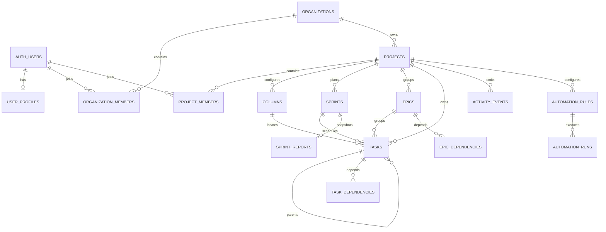

# NexusPlanner Data Model

Ultima revision: 2026-09-26

## 1. Alcance y fuente de verdad

Este documento describe el modelo persistente que realmente existe en las migraciones de `supabase/migrations`. No sustituye al SQL: ante una discrepancia, las migraciones son la fuente de verdad.

El esquema inicial esta consolidado en `00000000000000_baseline_schema.sql`. Las migraciones posteriores agregan o corrigen comandos de dominio, colores de estados y politicas de Storage. El baseline no debe regenerarse para cada cambio; los cambios nuevos deben vivir en migraciones incrementales.

La base contiene dos capas de modelado:

- El modelo actual multi-organizacion, centrado en `organizations`, `projects`, miembros, epicas, tareas y sprints.
- Un modelo anterior de tableros personales, centrado en `boards`. Algunas tablas conservan `board_id` y `project_id` para compatibilidad. No se debe extender el modelo legado sin confirmar que el frontend todavia lo necesita.

## 2. Jerarquia funcional

La jerarquia principal del producto es:

```text
auth.users
  -> user_profiles
  -> organization_members -> organizations
       -> projects
          -> project_members
          -> columns / column_order
          -> epics -> tasks
          -> sprints -> tasks
          -> activity_events
          -> automation_rules -> automation_runs
          -> sprint_reports
```

Una organizacion es la frontera superior de colaboracion. Un proyecto siempre pertenece a una organizacion. Las tareas, epicas, columnas, sprints, reportes y automatizaciones se delimitan por proyecto.

## 3. Vista de relaciones



Este diagrama resume el camino principal. Las invitaciones, tags, notas, catalogos y jobs se explican por separado.

## 4. Identidad y perfiles

### `auth.users`

Tabla administrada por Supabase Auth. Es la identidad canonica y no pertenece al esquema `public`. Los JWT emitidos por Auth exponen el usuario actual mediante `auth.uid()`.

### `user_profiles`

Extension publica del usuario autenticado:

| Campo | Uso |
| --- | --- |
| `id` | UUID compartido con `auth.users.id` |
| `full_name`, `job_title` | Identidad visible y puesto |
| `skills` | Lista de habilidades |
| `organization` | Texto de perfil; no reemplaza a `organizations` |
| `avatar_url` | URL del avatar |
| `preferences` | Preferencias extensibles en JSON |
| `created_at`, `updated_at` | Auditoria |

Existe `handle_new_user_profile()`, pero el baseline versionado no instala un trigger sobre `auth.users`. Por eso ningun agente debe asumir que el perfil se crea automaticamente: debe revisar el flujo de alta del cliente o agregar un trigger en una migracion deliberada.

## 5. Organizaciones

### `organizations`

Frontera de colaboracion superior. Conserva `name`, `logo_url`, `created_by` y timestamps. `created_by` identifica al creador historico; la autorizacion vigente se determina con `organization_members`, no solo con este campo.

### `organization_members`

Relacion usuario-organizacion. Los roles permitidos son:

- `owner`: control total y responsabilidad de conservar al menos un owner.
- `admin`: gestion de organizacion y miembros.
- `member`: acceso ordinario.

Los comandos de cambio y eliminacion protegen al ultimo owner. No se deben modificar roles con un `UPDATE` directo desde clientes si existe un command RPC equivalente.

### `organization_invitations`

Invitaciones entre usuarios existentes. Registra organizacion, invitador, invitado, estado, creacion y respuesta. Estados validos: `pending`, `accepted`, `declined`. La base evita auto-invitaciones y duplicados pendientes mediante constraints/indices.

Los comandos de aceptar y rechazar validan que el usuario autenticado sea el invitado y producen los cambios asociados.

## 6. Proyectos y acceso

### `projects`

Unidad de trabajo desplegada dentro de una organizacion:

| Campo | Uso |
| --- | --- |
| `organization_id` | Organizacion propietaria |
| `user_id` | Creador/propietario historico heredado |
| `title`, `description` | Identidad funcional |
| `project_key` | Prefijo corto de IDs visibles |
| `visibility` | `organization` o `private` |
| `allow_board_task_creation` | Regla de creacion desde tablero |
| `banner_url` | Recurso visual de Storage |
| `task_sequence`, `epic_sequence`, `issue_sequence` | Contadores internos para IDs visibles |

`project_key` es unico sin distinguir mayusculas y se usa para IDs como `CRECE-101`. La generacion se hace en la base para evitar condiciones de carrera.

`create_project_command` crea en una transaccion el proyecto, su owner, tags, columnas por defecto, orden de columnas, evento y job asociado. Crear manualmente solo una fila de `projects` produce un proyecto incompleto.

### `project_members`

Relacion usuario-proyecto. Roles permitidos: `owner` y `member`. Un usuario debe pertenecer primero a la organizacion antes de agregarse al proyecto.

La visibilidad se calcula de esta forma:

- Un miembro explicito puede ver el proyecto.
- Un miembro de la organizacion puede ver un proyecto con visibilidad `organization`.
- Un proyecto `private` requiere membresia explicita.

La mutacion ordinaria requiere membresia de proyecto. La administracion requiere rol `owner`.

### `user_project_board_preferences`

Preferencia de tablero por usuario y proyecto. Su llave primaria compuesta impide mas de una preferencia para el mismo par.

`selected_scope` admite `kanban` o `sprint`. Sin fila guardada, `get_project_board_view()` conserva Sprint cuando existe uno activo y usa Kanban en caso contrario. El valor solicitado puede diferir del scope efectivo: si se guardo `sprint` pero no existe un sprint activo, el RPC devuelve Kanban. La tabla no mueve tareas ni cambia sprints; solo conserva la eleccion de visualizacion.

Las filas se eliminan en cascada al borrar el usuario o proyecto. RLS limita cada fila al usuario propietario dentro de proyectos visibles. El rol `authenticated` solo recibe lectura directa; las escrituras pasan por `set_project_board_scope_command()` para conservar la validacion de Sprint activo.

### `project_invitations`

Invitaciones al proyecto con el mismo ciclo `pending`/`accepted`/`declined`. Aceptar una invitacion agrega membresia al proyecto, pero el usuario tambien debe cumplir las reglas de organizacion.

### `project_tags`

Etiquetas de texto pertenecientes a un proyecto. El comando de creacion de proyecto puede crearlas como parte de la misma operacion.

## 7. Tablero, columnas y estados

### `columns`

Estados configurables del flujo. Los campos vigentes son `name`, `position`, `project_id`, el legado `board_id`, timestamps y `color` agregado por una migracion posterior.

`color` solo acepta la paleta de 12 valores definida por la constraint de la migracion `20260904181108_add_column_status_badge_colors.sql`. Ese color representa el estado en badges y puede reutilizarse en futuras superficies visuales.

Una columna no es un catalogo global: pertenece al proyecto y constituye el estado real de una tarea ubicada en tablero.

### `column_order`

Conserva un arreglo JSON `column_ids` para el orden visual. Puede estar asociado a un proyecto actual o a un `board_id` legado. Cambiar columnas exige mantener esta fila consistente.

### `boards`

Modelo personal anterior: `user_id`, `name`, `created_at`. Todavia aparece en FKs y politicas antiguas. El flujo principal de NexusPlanner usa proyectos; antes de eliminarlo se requiere una auditoria completa del frontend y de datos existentes.

## 8. Tareas

### `tasks`

Entidad operativa central:

| Grupo | Campos |
| --- | --- |
| Identidad | `id`, `task_id_display`, `title`, `subtitle`, `description` |
| Ubicacion | `project_id`, `column_id`, `position`, `in_backlog` |
| Planificacion | `sprint_id`, `epic_id`, `planned_start_date`, `planned_end_date` |
| Clasificacion | `issue_type_id`, `priority_id`, `story_points` |
| Personas | `assignee_id` |
| Jerarquia | `parent_task_id` |
| Integracion | `github_link` |
| Auditoria | `created_at`, `updated_at` |

Reglas funcionales importantes:

- `project_id` delimita siempre la autorizacion y debe coincidir con la epica, sprint y columna asociados.
- `in_backlog = true` expresa que la tarea no esta en el tablero activo. No debe inferirse el backlog solo por `column_id`.
- Una tarea puede estar planificada en un sprint futuro sin ocupar una columna del tablero activo.
- `planned_start_date` y `planned_end_date` alimentan calendario y timeline. Un cambio por drag and drop debe persistir estas fechas.
- `task_id_display` se genera con el `project_key` y el contador del proyecto.
- `assignee_id` debe ser asignable dentro del proyecto.
- `story_points` se almacena como texto para soportar catalogos distintos; `story_points_to_number()` lo normaliza para reportes.

Estados canonicos de ubicacion:

| Destino | `in_backlog` | `column_id` | `sprint_id` |
| --- | --- | --- | --- |
| Backlog | `true` | `NULL` | `NULL` |
| Kanban continuo | `false` | Columna del proyecto | `NULL` |
| Sprint | `false` | Columna del proyecto | Sprint activo o futuro del proyecto |

`create_task_command`, `assign_task_command`, `move_task_to_backlog_command`, `move_task_to_kanban_command`, `move_task_to_sprint_command`, `move_task_column_command` y `schedule_task_command` son las rutas recomendadas de mutacion. Validan permisos, pertenencia y coherencia, y registran actividad. `move_task_destination_command` concentra la transicion pero esta revocada a clientes y solo sirve como nucleo de los wrappers.

### `task_dependencies`

Aristas dirigidas entre tareas. Tipos admitidos:

- `finish-to-start`
- `start-to-start`
- `finish-to-finish`
- `start-to-finish`

`lag_days` agrega margen. Triggers evitan autorreferencias, ciclos y relaciones incoherentes entre proyectos. La vista timeline del tablero actualmente no necesita dibujar conectores, aunque el modelo soporte dependencias.

### Subtareas

`parent_task_id` implementa la jerarquia tarea-subtarea. El esquema no crea una tabla separada. Cualquier regla sobre profundidad maxima debe verificarse en el codigo antes de asumirla.

## 9. Epicas y roadmap

### `epics`

Agrupador de trabajo por proyecto. Incluye owner, fase, esfuerzo, ID visible, fechas, color y timestamps.

`start_date` y `end_date` son fechas explicitas de la epica. No se recalculan automaticamente a partir de las tareas en el baseline. Por tanto, roadmap puede mostrar un rango distinto al backlog si las tareas llegan mas lejos; sincronizar ambos conceptos requiere una decision de producto y una migracion/command especifico.

### `epic_phases`

Catalogo ordenado de fases con nombre y color. Se inicializa con Backlog, Descubrimiento, Diseno, Desarrollo, Validacion y Cerrada.

### `epic_dependencies`

Aristas entre epicas con los mismos cuatro tipos de dependencia y `lag_days`. La descripcion historica menciona dependencias cross-project, pero los triggers vigentes incluyen una validacion de mismo proyecto. El comportamiento ejecutable del trigger prevalece sobre el comentario antiguo.

### `roadmap_settings`

Preferencias por usuario y proyecto. Actualmente almacena `child_level_issue_scheduling`. Es una configuracion personal, no una propiedad global del proyecto.

## 10. Sprints

### `sprints`

Timeboxes del proyecto. Estados validos:

- `future`: planificado.
- `active`: en ejecucion.
- `closed`: finalizado.

`start_date` y `end_date` son timestamps. La constraint exige que el final sea posterior al inicio. Un indice parcial unico y `validate_single_active_sprint()` impiden mas de un sprint activo por proyecto.

Los sprints deben ordenarse por fechas, no por momento de creacion: un sprint creado despues puede iniciar antes que otro ya existente.

### Cierre de sprint

`complete_sprint_command` bloquea y valida el sprint, identifica tareas terminadas por columnas terminales y exige exactamente una disposicion para cada tarea incompleta. Las disposiciones permiten devolver al backlog, mover al Kanban continuo o mover a un sprint futuro. Antes de mover el trabajo genera un snapshot inmutable en `sprint_reports`. Al cerrar, las preferencias de vista Sprint del proyecto se normalizan a Kanban.

### `sprint_reports`

Reporte historico por sprint. Conserva:

- identidad, meta y fechas del sprint;
- conteos de tareas completas e incompletas;
- puntos totales, completados e incompletos;
- tasas por tareas y por puntos;
- `snapshot` JSON con el detalle en el instante del cierre;
- actor y tiempo de generacion.

El reporte no se debe reconstruir leyendo el estado actual de las tareas: las tareas pueden cambiar despues. La fuente historica es `snapshot`.

## 11. Catalogos

### `issue_types`

Tipos ordenados con nombre, icono y color. El seed instala Tarea, Historia, Bug, Mejora y Sub-tarea.

### `priorities`

Prioridades ordenadas por `level` y `position`, con color. El seed instala Baja, Media, Alta y Critica.

### `point_systems` y `point_values`

Sistema de estimacion y sus valores. El seed instala Fibonacci con `1, 2, 3, 5, 8, 13, 21`.

Los catalogos son datos compartidos de instalacion. `supabase/seed.sql` debe conservarse idempotente y libre de informacion personal.

## 12. Actividad, notificaciones y automatizaciones

### `activity_events`

Registro normalizado de eventos de organizacion/proyecto/sprint/tarea. `event_type` identifica el hecho y `payload` conserva detalles extensibles. `event_key` permite deduplicacion cuando el emisor proporciona una clave estable.

`record_activity_event()` es la interfaz recomendada. Un trigger normaliza los eventos y otro evalua reglas de automatizacion despues de su insercion.

### `user_notifications`

Notificaciones dirigidas a un usuario. Incluyen tipo, titulo, mensaje, actor, referencias opcionales, payload, lectura y deduplicacion. El usuario solo debe leer/actualizar sus propias notificaciones.

Los triggers generan notificaciones para asignaciones, miembros agregados y sprints completados. `create_user_notification()` puede omitir notificar al mismo actor.

### `automation_rules`

Reglas por proyecto con evento disparador, condiciones JSON y acciones JSON. Solo los owners pueden administrarlas. `enabled`, `last_run_at` y timestamps controlan su ciclo.

### `automation_runs`

Auditoria de cada ejecucion: evento, acciones intentadas/exitosas/fallidas, resultado, error y estado `pending`, `succeeded`, `failed` o `partial`.

La evaluacion se ejecuta dentro de la base tras un `activity_event`. Antes de agregar acciones nuevas se deben revisar `execute_automation_action()` y los formatos JSON existentes.

## 13. Cola de comandos

### `command_jobs`

Outbox persistente para trabajo asincrono:

| Campo | Funcion |
| --- | --- |
| `queue_name`, `job_type` | Enrutamiento |
| `payload` | Datos de ejecucion |
| `status` | `queued`, `processing`, `done`, `failed` |
| `attempts`, `max_attempts` | Reintentos |
| `available_at` | Retraso/backoff |
| `locked_at`, `locked_by` | Lease del worker |
| `job_key` | Deduplicacion opcional |
| `last_error`, `processed_at` | Diagnostico |

`claim_command_jobs()` usa `FOR UPDATE SKIP LOCKED`, por lo que varios workers pueden reclamar en paralelo sin tomar el mismo job. `complete_command_job()`, `fail_command_job()` y `reset_stale_command_jobs()` completan el protocolo.

El esquema no instala un scheduler. Las funciones de mantenimiento y escaneo existen, pero necesitan una llamada externa o una migracion futura de cron.

## 14. Editor

### `editor_notes`

Contenido JSON del editor asociado a proyecto o al modelo `board_id` legado. `is_manual_save` identifica guardados deliberados; `is_snapshot` distingue la nota activa de versiones historicas.

## 15. Archivos

Storage conserva objetos fuera de las tablas de dominio. Los buckets versionados son:

| Bucket | Publico | Limite | Tipos esperados |
| --- | --- | --- | --- |
| `project-assets` | Si | 10 MiB | Imagenes de proyecto/organizacion |
| `avatars` | Si | 5 MiB | Imagenes de perfil |
| `task-images` | Si | 10 MiB | Imagenes en descripciones de tareas |

Las tablas guardan URLs o referencias, no el binario. Borrar una organizacion directamente no debe intentar borrar `storage.objects`: Supabase bloquea esa eliminacion para prevenir objetos huerfanos. El flujo correcto usa Storage API para objetos y despues el command de dominio.

## 16. Cascadas y eliminacion

Las FKs aplican cascadas en buena parte de la jerarquia:

- Organizacion eliminada: miembros, invitaciones, proyectos y datos hijos relacionados se eliminan segun FKs.
- Proyecto eliminado: miembros, tags, columnas, sprints, epicas, tareas, eventos, automatizaciones y reportes relacionados se eliminan o pierden referencia segun cada FK.
- Epica eliminada: `tasks.epic_id` se establece en `NULL`.
- Sprint eliminado: `tasks.sprint_id` se establece en `NULL`.
- Columna eliminada: las relaciones historicas incluyen cascada para las tareas asociadas; por eso borrar columnas requiere especial cuidado y debe ocurrir mediante el flujo del producto.
- Usuario eliminado: varias referencias de autoria/asignacion usan `SET NULL`, mientras el perfil comparte identidad con Auth.

No se debe deducir una cascada por intuicion. Antes de cambiar un delete, inspeccionar las FKs exactas y ejecutar una prueba local con datos desechables.

## 17. Triggers e invariantes

Los triggers y funciones mas importantes son:

- Generacion serial de IDs visibles de tareas y epicas.
- `updated_at` automatico en entidades mutables.
- Un solo sprint activo por proyecto.
- Dependencias sin ciclos y sin autorreferencia.
- Coherencia proyecto-epica de cada tarea.
- Normalizacion de eventos y reportes.
- Evaluacion de reglas tras eventos.
- Creacion de notificaciones por asignacion, membresia y cierre de sprint.

Una mutacion que omite commands puede seguir activando algunos triggers, pero perder validaciones, eventos o jobs que viven en la funcion de dominio. Por eso "la fila se guardo" no significa que el caso de uso se ejecuto correctamente.

## 18. Seed y datos de instalacion

`supabase/seed.sql` contiene solo catalogos por defecto. Puede ejecutarse varias veces sin crear duplicados. Nunca debe contener:

- usuarios reales;
- organizaciones o proyectos personales;
- tareas, reportes o notas;
- tokens, claves, URLs privadas o dumps;
- datos copiados de la Raspberry.

Los datos reales pertenecen al volumen/base de cada despliegue y a sus backups privados, no a Git.

## 19. Reglas para evolucionar el modelo

1. Crear una migracion incremental con `npx supabase migration new <nombre>`.
2. Definir tabla, constraints, indices, grants y RLS en la misma unidad de cambio cuando aplique.
3. Preferir constraints y commands SQL para invariantes que deben respetar todos los clientes.
4. Mantener `SECURITY DEFINER` con `search_path` fijo y validacion explicita de `auth.uid()`.
5. No editar el baseline para representar un cambio nuevo ya desplegado.
6. Probar desde cero con `npx supabase db reset` solo en una instancia local desechable.
7. Probar upgrade sobre una copia/restauracion, no directamente sobre la base personal.
8. Actualizar este documento, `ARCHITECTURE.md` y `SECURITY.md` si cambia el contrato.

## 20. Consultas de inspeccion utiles

```sql
-- Tablas publicas y RLS
select schemaname, tablename, rowsecurity
from pg_tables
where schemaname = 'public'
order by tablename;

-- Politicas efectivas
select schemaname, tablename, policyname, roles, cmd, qual, with_check
from pg_policies
where schemaname = 'public'
order by tablename, policyname;

-- FKs y acciones de borrado
select conrelid::regclass as source_table,
       confrelid::regclass as target_table,
       conname,
       confdeltype
from pg_constraint
where contype = 'f'
  and connamespace = 'public'::regnamespace
order by 1, 2;
```

Estas consultas son de lectura. Ejecutarlas antes y despues de una migracion ayuda a verificar que la documentacion coincide con la base desplegada.
